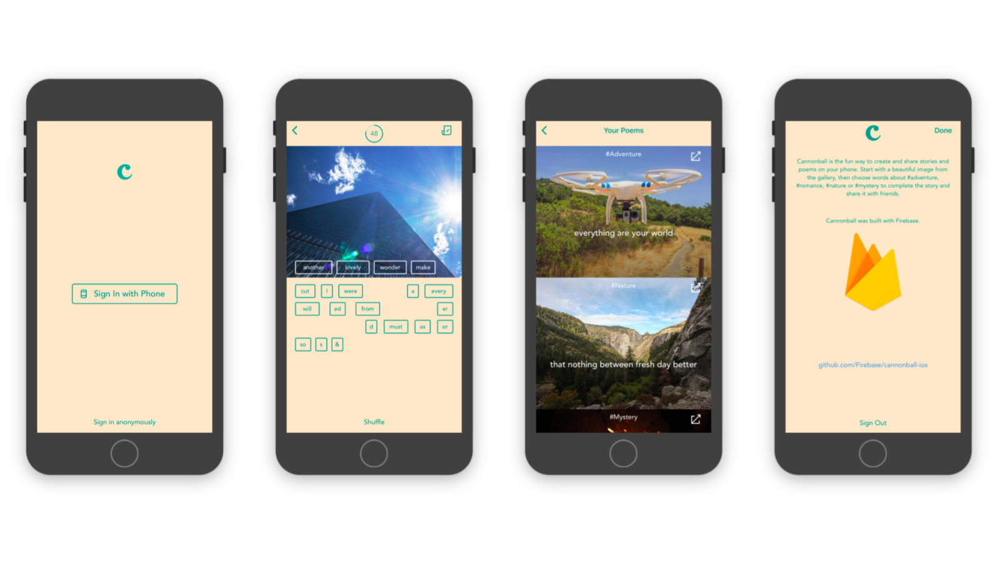

# Cannonball for iOS

Cannonball is the fun way to create and share stories and poems on your phone. Start with a beautiful image from the gallery, then choose words about #adventure, #romance, #nature or #mystery to complete the story and share it with friends.

## Introduction

This repository contains the source code for Cannonball, an iOS application written in Swift built with [Firebase](https://firebase.google.com/).

Cannonball is a canonical sample iOS app to demonstrate how to use [Firebase](https://firebase.google.com/), the easiest way to build the best apps.

Cannonball uses many of the features available in Firebase, including Realtime Database, Crashlytics, Google Analytics for Firebase, and Firebase Auth.

## Screenshots

## Support

If you've found an error in this sample, please file an issue.

Patches are encouraged, and may be submitted by forking this project and
submitting a pull request through GitHub.

### Prerequisites

* Xcode 9 or later (https://developer.apple.com/xcode/downloads/)
* CocoaPods 1.2.1 or later (https://guides.cocoapods.org/using/getting-started.html)

To get started and run the app, you need to follow these simple steps:

1. Clone this repo: `git clone https://github.com/Firebase/cannonball-ios/`
1. Change directories to the repo you just cloned: `cd cannonball-ios`
1. Install the required pods: `pod install`
1. Open Cannonball.xcworkspace in Xcode: `open Cannonball.xcworkspace`
1. If you don't already have a Firebase account, sign up for Firebase at [firebase.google.com](https://firebase.google.com/)
1. Follow the instructions to [add Firebase to your iOS app](https://firebase.google.com/docs/ios/setup#add_firebase_to_your_app).
1. Enable [Phone Sign-In](https://firebase.google.com/docs/auth/ios/phone-auth) and [Anonymous Sign-In](https://firebase.google.com/docs/auth/ios/anonymous-auth).
1. You're all set! Run Cannonball on your iPhone or the iOS Simulator.

## Compatibility

This project is written in Swift 4.1, which requires Xcode 9 or later to run.

Cannonball for iOS is compatible with iOS 8+.

## Contributors

* [Romain Huet](https://twitter.com/romainhuet)
* [Gareth Jones](https://twitter.com/gpj)
* [Ramón Argüello](https://twitter.com/monchote)
* [Javier Soto](https://twitter.com/Javi)
* [Chris Aniszczyk](https://twitter.com/cra)
* [Kang Chen](https://twitter.com/kang)
* [Paul Buser](https://twitter.com/pcbuser)
* [Kiana McNellis](http://kmcnellis.com/)

## License

Copyright 2016 Google, Inc.

Licensed to the Apache Software Foundation (ASF) under one or more contributor
license agreements.  See the NOTICE file distributed with this work for
additional information regarding copyright ownership.  The ASF licenses this
file to you under the Apache License, Version 2.0 (the "License"); you may not
use this file except in compliance with the License.  You may obtain a copy of
the License at

  http://www.apache.org/licenses/LICENSE-2.0

Unless required by applicable law or agreed to in writing, software
distributed under the License is distributed on an "AS IS" BASIS, WITHOUT
WARRANTIES OR CONDITIONS OF ANY KIND, either express or implied.  See the
License for the specific language governing permissions and limitations under
the License.
